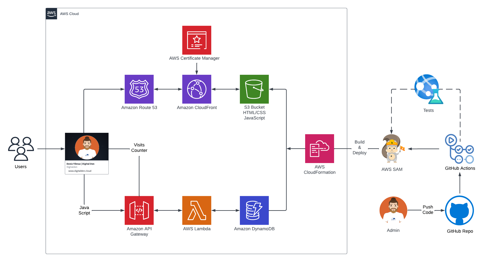
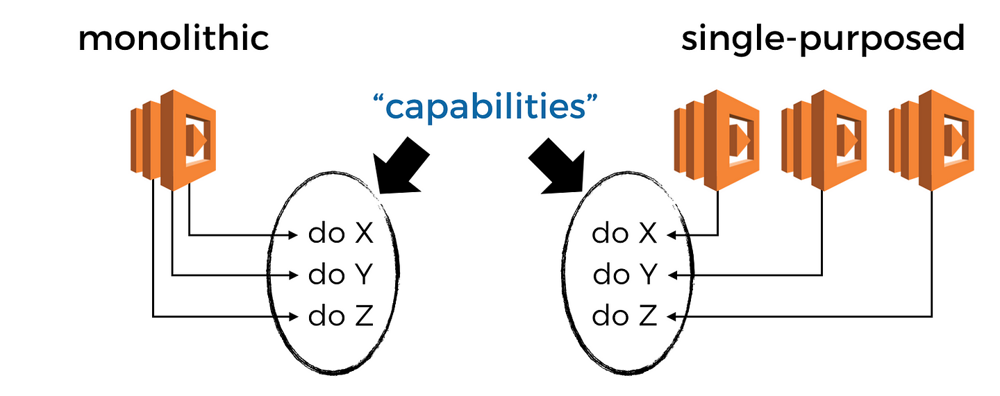
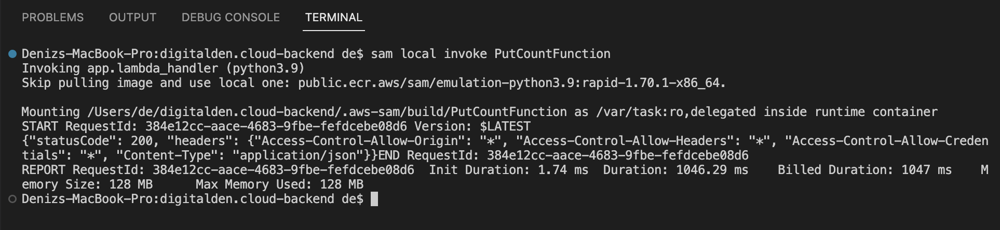
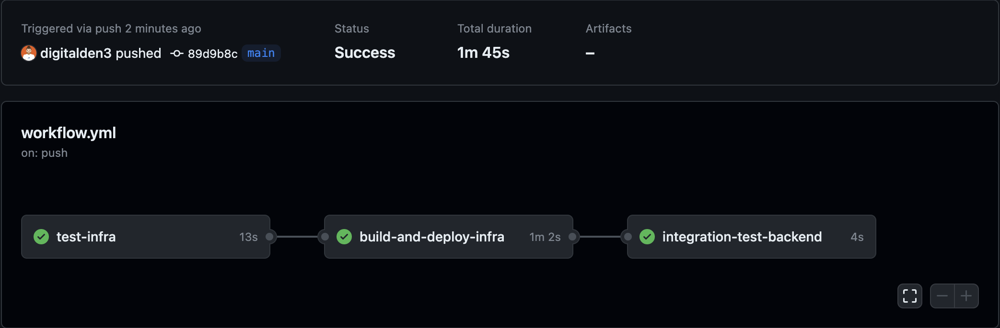
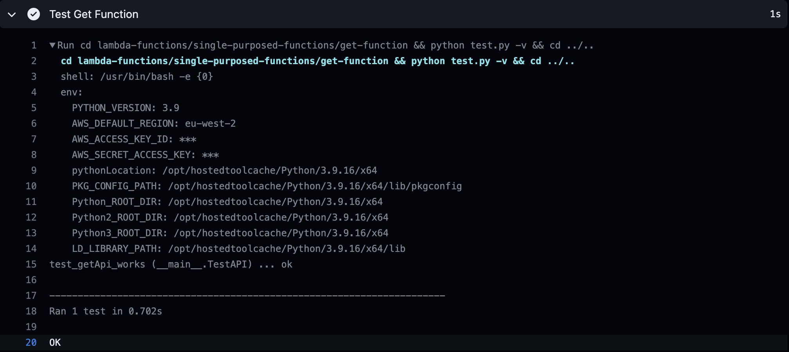

<br />

<p align="center">
  <a href="img/">
    
  </a>
  <h1 align="center">A Serverless Website</h1>
  <p align="center">
    Built on AWS using AWS SAM CLI for IaC and GitHub Actions for CI/CD.
     <br />
    This is the back-end repo to the website:
    <br />
    https://digitalden.cloud
  </p>
</p>


</p>

<details open="open">
  <summary><h2 style="display: inline-block">Project Details</h2></summary>
  <ol>
    <li><a href="#tech-stack">Tech Stack</a>
    <li><a href="#project-date">Project Date</a></li>
    </li>
    <li><a href="#project-description">Project Description</a></li>
    <li><a href="#aws-sam-cli">AWS SAM CLI</a></li>    
    <li><a href="#dynamodb">DynamoDB</a></li>
    <li><a href="#lambda-function">Lambda Function</a></li>
    <li><a href="#api-gateway">API Gateway</a></li>
    <li><a href="#javascript">JavaScript</a></li>
    <li><a href="#sam-local-invoke">SAM Local Invoke</a></li>
    <li><a href="#github-actions">Github Actions</a></li>
    <li><a href="#unit-testing">Unit Testing</a></li>
    <li><a href="#integration-testing">Integration Testing</a></li>
    <li><a href="#project-files">Project Files</a></li>
    <li><a href="#acknowledgements">Acknowledgements</a></li>
  </ol>
</details>

### Tech Stack
------------------
- AWS SAM
- DynamoDB
- AWS Lambda
- API Gateway
- JavaScript
- GitHub Actions (CI/CD)

### Project Description
------------------

The architecture is deployed by using SAM CLI as the Infrastructure as Code method and GitHub Actions as the CI/CD method.

The backend components of the website support a counter of visitors to the website.  The data (visitor count value) is stored in a DynamoDB database, which is accessed by a Lambda function written in Python3.  The function is accessed through a REST API created with API Gateway, which when called will invoke the Lambda function and forward back the direct response due to a “Lambda proxy” configuration.  Each time the page is loaded, a short JavaScript script utilizes Fetch API to ping the endpoint of the counter API, before rendering the response in the footer of the page.  

The website fetches and displays the latest visitor count, while the Lambda function handles incrementation as it interacted exclusively with the database.

### Project date
------------------
16.04-2023

### AWS SAM CLI
------------------

The SAM CLI is a command line tool that used with AWS SAM templates to build and run serverless applications. It adds functionality for building and testing Lambda applications. It uses Docker to run the functions in an Amazon Linux environment that matches Lambda. It can also emulate the application's build environment and API.

To use the SAM CLI, you need the following tools.

* SAM CLI: [Install the SAM CLI](https://docs.aws.amazon.com/serverless-application-model/latest/developerguide/serverless-sam-cli-install.html)
* Python 3: [Install Python 3](https://www.python.org/downloads/)
* Docker: [Install Docker community edition](https://docs.aws.amazon.com/serverless-application-model/latest/developerguide/install-docker.html#install-docker-instructions)


#### Initializing the Project:

```bash
sam init
```

The sam init command initializes a new application project. To start with, select Python for the Lambda code and Hello World Example. The AWS SAM CLI downloads a starter template and creates a project folder directory structure. The stack includes an API Gateway, IAM Role and Lambda function.

#### Building the Application for Deployment:

```bash
sam build
```

The sam build command packages the function dependencies and organizes the project code and folder structure to prepare for deployment. The AWS SAM CLI creates a .aws-samdirectory and organizes the application dependencies and files there for deployment.

#### Deploying the Application:

```bash
sam deploy --guided
```

Configure the application's deployment settings and deploy to the AWS Cloud to provision my resources.

Using the sam deploy --guided command to deploy the application through an interactive flow. The AWS SAM CLI guides you through configuring the application's deployment settings, transforming the template into AWS CloudFormation, and deploying to AWS CloudFormation to create the resources.

### DynamoDB
------------------
In the SAM template, create a new DynamoDBTable resource to hold visitor count data. Name the table visitor-count-table. Set capacity to On-demand to save on costs. The table holds a single attribute (ID), which will be updated by the Lambda function.

```yaml
  DynamoDBTable:
      Type: AWS::DynamoDB::Table
      Properties:
        TableName: visitor-count-table
        BillingMode: PAY_PER_REQUEST
        AttributeDefinitions:
          - AttributeName: "ID"
            AttributeType: "S"
        KeySchema:
          - AttributeName: "ID"
            KeyType: "HASH"
```

### Lambda Function
------------------
There are two types of architectural patterns included in this repo.

- A Monolithic Function (Putting all code in single Lambda deployment)
- Two Single Purposed Functions (Each Lambda per functionality)

When deciding what architectural pattern to use there are many trade-offs between monoliths and services. A monolithic function has more branching and in general does more things, this would understandably take more cognitive effort to comprehend and follow through to the code that is relevant to the problem at hand.

Please read this interesting article by [Yan Cui](https://theburningmonk.com/2018/01/aws-lambda-should-you-have-few-monolithic-functions-or-many-single-purposed-functions/), to help you decide which architectural pattern to use:



#### Monolithic-function
---

This Python script for the monolithic function updates the DynamoDB table with a visitor count. The function takes in an event and context as parameters, retrieves an item from the table with the key "visitors", increments the value of the "visitors" attribute by 1, and returns a JSON response with the updated visitor count. Note that the script assumes that the table has a primary key attribute named "ID" and that the item with the key "visitors" exists in the table:

```python
import json
import boto3
from boto3.dynamodb.conditions import Key

TABLE_NAME = "visitor-count-table"

dynamodb_client = boto3.client('dynamodb', region_name="eu-west-2")

dynamodb_table = boto3.resource('dynamodb', region_name="eu-west-2")
table = dynamodb_table.Table(TABLE_NAME)

def lambda_handler(event, context):
    response = table.get_item(
        TableName =TABLE_NAME,
        Key={
            "ID":'visitors',
        }
        )
    item = response['Item']

    table.update_item(
        Key={
            "ID":'visitors',
        },
        UpdateExpression='SET visitors = :val1',
        ExpressionAttributeValues={
            ':val1': item['visitors'] + 1
        }
    )
    return{
        'statusCode': 200,
        'headers': {
            'Content-Type': 'application/json',
            'Access-Control-Allow-Origin': '*'
        },
      "body": json.dumps({"Visit_Count": str(item['visitors'] + 1)})
    }
```

Initially, I used the monolithic function before deciding to use two single-purposed function. 

I broke my monolithic function into two single-purposed functions by reconfiguring the Hello World Function deployed by SAM CLI. I created a get-function for getting values out of the database, and a put-function for putting items into my database. I then updated the python scripts for each function:

#### Single-Purposed-Function
---

This script for the get-function queries the table to retrieve the current visitor count:

```python
import boto3
import json
from boto3.dynamodb.conditions import Key

dynamodb = boto3.resource('dynamodb')
table = dynamodb.Table('visitor-count-table')

def get_count():
    response = table.query(
        KeyConditionExpression=Key('ID').eq('visitors')
        )
    count = response['Items'][0]['visitors']
    return count

def lambda_handler(event, context):
    
    return {
        'statusCode': 200,
        'headers': {
            'Access-Control-Allow-Origin': '*',
            'Access-Control-Allow-Headers': '*',
            'Access-Control-Allow-Credentials': '*',
            'Content-Type': 'application/json'
        },
        'body': get_count()
    }
```

In the put-function script, the update operation is an ADD operation, which increments the value of the "visitors" attribute by the specified value:

```python
import boto3
import json
from boto3.dynamodb.conditions import Key

dynamodb = boto3.resource('dynamodb')
table = dynamodb.Table('visitor-count-table')


def lambda_handler(event, context):
    response = table.update_item(     
        Key={        
            'ID': 'visitors'
        },   
        UpdateExpression='ADD ' + 'visitors' + ' :incr',
        ExpressionAttributeValues={        
            ':incr': 1    
        },    
        ReturnValues="UPDATED_NEW"
    )

    return {
        'statusCode': 200,
        'headers': {
            'Access-Control-Allow-Origin': '*',
            'Access-Control-Allow-Headers': '*',
            'Access-Control-Allow-Credentials': '*',
            'Content-Type': 'application/json'
        }
    }
```

### API Gateway
------------------
The SAM CLI deploys API infrastructure under the hood. Rest API allows access to the URL endpoint to accept GET and POST methods. When API URL is accessed the Lambda function is invoked, returning data from the DynamoDB table.

It is important to configure CORS headers for this to work. In the response of the Lambda Functions,  insert the Access-Control-Allow-Origin headers:

```python
    return {
        'statusCode': 200,
        'headers': {
            'Access-Control-Allow-Origin': '*',
            'Access-Control-Allow-Headers': '*',
            'Access-Control-Allow-Credentials': '*',
            'Content-Type': 'application/json'
        }
    }
```
The code is a Python dictionary that sets the response headers for a web API endpoint. It specifies a response status code of 200 (indicating success), and sets the headers to allow requests from any origin, with any headers and credentials. The content type is set to JSON. Overall, this code allows a web API endpoint to respond to requests with a JSON payload and a 200 status code.

### JavaScript
------------------
In the index.html add the JavaScript. The JS makes a fetch request to my API from API gateway. The code fetches data from two different API endpoints, one for making a PUT request and another for making a GET request. It then extracts the JSON data returned by the GET request, updates an HTML element with that data, and logs the same data to the console for debugging purposes: 

```javascript
  <script type = "text/javascript">
    var apiUrl = "https://0qrguua9jg.execute-api.eu-west-2.amazonaws.com/Prod/put";
      fetch(apiUrl)
      .then(() => fetch("https://0qrguua9jg.execute-api.eu-west-2.amazonaws.com/Prod/get"))
      .then(response => response.json())
      .then(data =>{
          document.getElementById('hits').innerHTML = data
    console.log(data)});
  </script>
```

The website can now fetch and display the latest visitor count.

### SAM Local Invoke
------------------

```bash
sam local invoke
```

The sam local invoke command invokes the GetCountFunction and PutCountFunction locally. To accomplish this, the AWS SAM CLI creates a local container, builds the function, invokes it, and outputs the results:



### Github Actions
------------------
This project has a CI/CD pipeline on GitHub Actions workflow. View the complete workflow [HERE](.github/workflows/workflow.yml)

The pipeline performs automated testing, building, and deployment of the application in response to code changes pushed to the main or dev branches. The pipeline consists of three jobs, each with its own set of steps, that are executed in a sequential manner. 

The first job tests the infrastructure, the second job builds and deploys the infrastructure, and the third job performs an integration test. This pipeline ensures that changes made to the codebase are properly tested and deployed to production environments in a repeatable and automated way.

This project is utilizing GitHub Actions over an AWS CodePipeline for cost savings and is a better alternative based on the scope of this project. 



#### Unit Testing
------------------
The CI/CD pipeline activates upon pushing code starting with running Unit tests in python for the get-function and put-function.

This is the unit test script for testing the Python module named app:

import unittest
import app 

```python
class TestAPI(unittest.TestCase):
    def test_getApi_works(self):
        event = {'ID': 'visitors'}
        result = app.lambda_handler(event, 0)
        self.assertEqual(result['statusCode'], 200)

if __name__ == '__main__':
    unittest.main()
```

 The script uses the unittest module to define and run tests. The TestAPI class is defined, which contains a single test function called test_getApi_works. This test function checks whether the lambda_handler function in the app module returns a result with a status code of 200 when given a specific event. The unittest.main() function is called to run all the tests defined in the script.



The test-infra job is responsible for testing the infrastructure of the application. This test checks out the code, sets up the Python environment, installs the boto3 package, and test the get-function / put-function by running its test cases using Python's unittest module:

```yaml
jobs:  
  test-infra:
    runs-on: ubuntu-latest
    timeout-minutes: 3
    steps: 
      - uses: actions/checkout@v3
      - uses: actions/setup-python@v4
        with:
          python-version: ${{env.PYTHON_VERSION }}
      - name: install boto3
        run: pip install boto3
      - name: Test Get Function
        run: cd lambda-functions/single-purposed-functions/get-function && python test.py -v && cd ../..
      - name: Test Put Function
        run: cd lambda-functions/single-purposed-functions/put-function && python test.py -v && cd ../..
```
This job ensures that the infrastructure of the application is working as expected and has not been broken due to any recent changes. It is an essential part of the CI/CD pipeline that ensures the quality of the application's codebase.

#### AWS SAM Build and Deploy
------------------

GitHub Actions are set up in such that when you push an update to the SAM template or Python code, the tests get run. If the tests pass, the SAM application gets packaged and deployed to AWS.

This workflow updates the SAM stack currently deployed: 

```yaml
  build-and-deploy-infra:
    needs: test-infra
    runs-on: ubuntu-latest
    steps:
      - uses: actions/checkout@v2
      - uses: actions/setup-python@v2
        with:
          python-version: '3.9'
      - uses: aws-actions/setup-sam@v1
      - uses: aws-actions/configure-aws-credentials@v1
        with:
          aws-access-key-id: ${{ secrets.AWS_ACCESS_KEY_ID }}
          aws-secret-access-key: ${{ secrets.AWS_SECRET_ACCESS_KEY }}
          aws-region: eu-west-2
      - name: SAM Validate
        run: |
          sam validate
      - name: SAM Build
        run: |
          sam build
      - name: SAM Deploy
        run: |
          sam deploy --no-confirm-changeset --no-fail-on-empty-changeset
```

This deploys the application infrastructure to AWS and depends on my Unit Test to succeed. It runs on an Ubuntu machine, and uses Python and the AWS SAM CLI. It validates thhe SAM template, builds the infrastructure, and deploys it to AWS.

The AWS access keys are stored as GitHub Secrets and the user has very limited access to resources. The SAM Deploy assumes a role to deploy the needed resources. 

#### Integration Testing
------------------

```bash
integration-test:
		FIRST=$$(curl -s "https://0qrguua9jg.execute-api.eu-west-2.amazonaws.com/Prod/get" | jq ".body| tonumber"); \
		curl -s "https://0qrguua9jg.execute-api.eu-west-2.amazonaws.com/Prod/put"; \
		SECOND=$$(curl -s "https://0qrguua9jg.execute-api.eu-west-2.amazonaws.com/Prod/get" | jq ".body| tonumber"); \
		echo "Comparing if first count ($$FIRST) is less than (<) second count ($$SECOND)"; \
		if [[ $$FIRST -le $$SECOND ]]; then echo "PASS"; else echo "FAIL";  fi
```  
This is a the  shell script that tests the behavior of the API. The script sends a GET request to the API endpoint, saves the response body in a variable, and then sends a PUT request to the same API endpoint.

Next, the script sends another GET request to the API endpoint and saves the response body in a variable. The script then compares the values of the two response bodies using an if statement.

The purpose of the test is to check if the count value returned by the API has been properly incremented by the PUT request. To extract the count value from the JSON response body returned by the API, the jq command is used.

The integration test has been added to Github Action Workflow:

```yaml
  integration-test-backend:
    needs: build-and-deploy-infra
    runs-on: ubuntu-latest
    steps:
      - uses: actions/checkout@v2
      - run: make integration-test
```

This job (integration-test-backend) depends on the previous job called build-and-deploy-infra and runs on an Ubuntu operating system. The job checks out the source code from the repository and runs an integration test using the make command. 

The purpose of this job is to run integration tests on the application after it has been built and deployed to the infrastructure.

### Project Files
------------------
* [Github Action Workflows](.github/workflows/workflow.yml)
* [SAM template](template.yaml)

### Acknowledgements
------------------
* [Cloud Resume Challenge](https://cloudresumechallenge.dev/)
